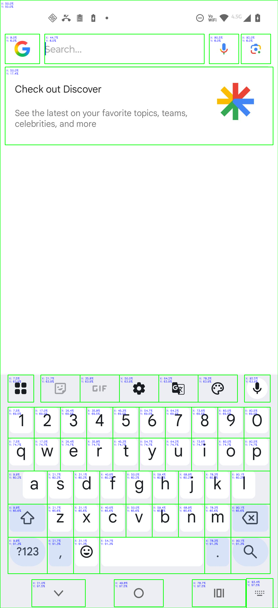

# Android Clickable Elements Overlay

A lightweight tool for inspecting Android user interfaces and visualizing all clickable elements currently displayed on the screen.

The project uses **UIAutomator2** to retrieve the UI hierarchy from a connected Android device and **OpenCV** to generate an overlay image highlighting clickable components and their relative screen coordinates.

## How It Works

1. Connects to an Android device using UIAutomator2.
2. Retrieves the current UI hierarchy in XML format.
3. Detects all elements with the attribute `clickable="true"`.
4. Captures a screenshot of the current screen.
5. Draws bounding boxes around clickable elements.
6. Displays the relative X and Y coordinates of each element.
7. Saves a new image containing the generated overlay.

## Example

The image on the left shows the original Android screen, while the image on the right shows the generated overlay highlighting all detected clickable elements and their relative screen coordinates.

<table align="center">
  <tr>
    <td align="center">
      <b>Original Screenshot</b><br>
      
    </td>
    <td align="center">
      <b>Clickable Elements Overlay</b><br>
      
    </td>
  </tr>
</table>

## Requirements

- Python 3.12+
- ADB installed and available in your PATH
- Android device connected via USB or network
- USB Debugging enabled
- UIAutomator2 properly initialized on the device

---

## Installation

### 1. Install Poetry

#### Linux / macOS

```bash
curl -sSL https://install.python-poetry.org | python3 -
```

#### Windows (PowerShell)

```powershell
(Invoke-WebRequest -Uri https://install.python-poetry.org -UseBasicParsing).Content | py -
```

Verify the installation:

```bash
poetry --version
```

---

### 2. Clone the Repository

```bash
git clone https://github.com/JairtonFilho/android_clickable_elements_overlay.git
cd android_clickable_elements_overlay
```

---

### 3. Install Dependencies

```bash
poetry install
```

---

### 4. Activate the Virtual Environment

```bash
poetry env activate
```

Copy and paste the result to terminal.


---

## Android Device Setup

Make sure your device is connected and recognized by ADB:

```bash
adb devices
```

Expected output:

```text
List of devices attached
XXXXXXXXXX    device
```

---

## Usage

With the virtual environment is already activated:

```bash
python main.py
```

---

## Output

During execution, the script:

- Retrieves the current UI hierarchy.
- Captures a screenshot of the device screen.
- Detects all clickable UI elements.
- Draws green bounding boxes around each element.
- Annotates each element with its relative coordinates.
- Saves the resulting image.

Generated files:

| File | Description |
|--------|-------------|
| `screenshot.png` | Original screen capture |
| `resultado.png` | Screenshot with clickable elements highlighted |

---

## Dependencies

The project relies on:

- OpenCV
- UIAutomator2

Defined in `pyproject.toml`:

```toml
dependencies = [
    "opencv-python>=4.11.0.86",
    "uiautomator2>=3.2.9"
]
```

---

## Project Structure

```text
android_clickable_elements_overlay/
├── assets/
│   ├── screenshot.png
│   └── resultado.png
├── main.py
├── pyproject.toml
├── poetry.lock
└── README.md
```

---

## Use Cases

- Android UI automation
- Mobile application testing
- UI inspection and debugging
- Bot development
- Dataset generation for computer vision
- Coordinate extraction for ADB-based automation workflows

---

## License

This project is licensed under the MIT License.